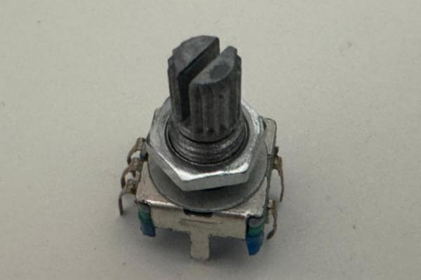
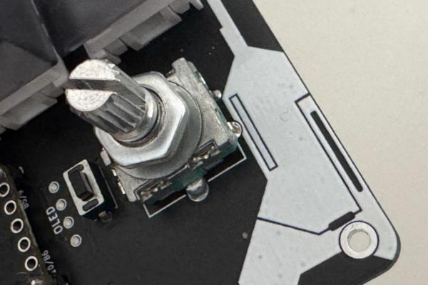
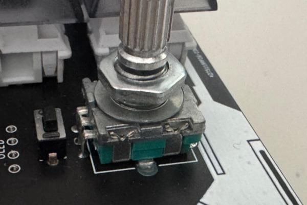

# Configurare il tastierino R12 di Khor
Come configurare il tastierino R12 di Khor installando l'ambiente QMK (Quantum Mechanical Keyboard).
Il repository principale di R12 si trova qui: https://github.com/MoltenKhor/R12
Il sito di QMK è questo: https://docs.qmk.fm/
La documentazione su Helios (micro basato su RP2040) comprensiva di pinout si trova qui: https://github.com/0xCB-dev/0xCB-Helios

# Tutti i passi per la configurazione
Questo tutorial presume che non si voglia seguire il percorso del forking del repository principale perché ad esempio:
 1. Non si dispone dell'ambiente di compilazione (es. mingw, ecc.) installato nel proprio PC
 2. Non si utilizza Github
 3. Non si conoscono le metodologie di compilazione e build, o non si sa cos'è un forking :-)

## Montaggio della tastiera

Seguire le istruzioni sulla pagina di Khor (https://github.com/MoltenKhor/R12) fino allo step 5.
Seguire le istruzioni sulla pagina di Khor (https://github.com/MoltenKhor/R12) fino allo step 5.
E' inoltre possibile montare un encoder rotativo con switch di tipo EC11 

ed utilizzarlo sia per la rotazione (es. rotella del mouse) sia come tredicesimo tasto. La posizione in cui va saldato è del tutto evidente.

## Installazione dell'ambiente QMK in Windows
Nella pagina Getting Started di QMK, https://docs.qmk.fm/newbs_getting_started, potete trovare il link a QMK MSYS: https://msys.qmk.fm/. Il pulsante "latest version" porterà al download dell'installer per l'ultima versione.
Installate l'ambiente facendo attenzione al fatto che l'ambiente completo occuperà quasi una decina di Gb, quindi assicuratevi di avere lo spazio necessario sul disco (io l'ho installato su un disco esterno).

Una volta completata l'installazione potete avviare l'ambiente e dare il comando

    qmk setup

che vi chiederà dove creare la root dei file per QMK (che di fatto è il famoso fork del repository QMK).
Vi ritroverete una cartella "qmk_firmware" che conterrà una directory "keyboards". Qui dentro potete creare una cartella col nome che vorrete dare al vostro firmware (es. R12-simont). Seguite le istruzioni più sotto (e i file di esempio in questo repository) per configurare il tastierino a piacere.

## Creazione del firmware
Una volta costruiti i file necessari per la configurazione, nell'ambiente QMK MSYS potete eseguire il comando:

    qmk compile -kb <keyboard> -km default
Dove \<keyboard> è il nome della vostra directory.
Se i file sono corretti, verrà generato nella root della cartella qmk_firmware un file dal nome

    <keyboard>_default.uf2
 che è pronto per essere caricato sulla R12.
 ## Caricamento del firmware
 Collegate la tastiera al PC e premete due volte di seguito il pulsantino di reset che si trova tra il micro e l'encoder (o lo spazio per l'encoder se non l'avete montato). Sul PC comparirà un nuovo disco che di fatto è la flash del micro (RP2040). Copiate il file .uf2 appena generato sulla directory radice del disco flash, il micro si resetterà e la vostra tastiera dovrebbe essere pronta per l'uso con la vostra configurazione.
